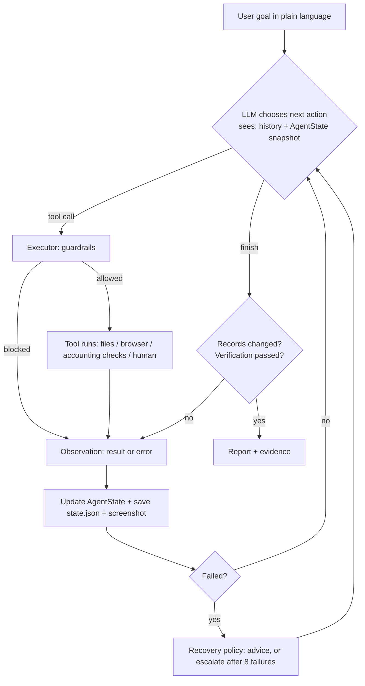

# Architecture

## The loop in one picture

## Components

| File | Responsibility | Talks to |
|---|---|---|
| `agent/agent.py` | The loop: call the LLM, run the tool calls, feed back observations and state, stop on finish/budget/escalation, write the report | LLM, Executor |
| `agent/llm.py` | The only Anthropic API call (model, adaptive thinking, effort, caching, refusal fallback) | Anthropic API |
| `agent/planner.py` | System prompt (how the worker behaves), `update_plan` and `finish` tools | AgentState |
| `agent/state.py` | AgentState: goal, plan, actions, facts, approvals, errors, evidence, verification | everyone |
| `agent/executor.py` | Tool registry and **guardrails**; logs every action | Tools |
| `agent/recovery.py` | Limits on failure: repeated-failure warning, escalation | AgentState |
| `agent/verifier.py` | Independent, code-based check of the saved record against the invoice | AcmeBooks JSON API |
| `tools/filesystem.py` | List and read documents, sandboxed to `data/` | Shared drive |
| `tools/browser.py` | Open, read, fill and click in a real Chromium, restricted to the internal app, with screenshots | AcmeBooks web UI |
| `tools/accounting.py` | Invoice validation, vendor match, three-way match, approval policy | Policy YAML, JSON API |
| `tools/human.py` | Approval and clarification requests | Terminal (or a scripted human in tests) |
| `tools/memory.py` | Company memory across runs: `remember`, `recall`, shown to the model at the start | `memory/company_memory.json` |
| `scripts/run_evals.py` | Runs the real agent on 6 scenarios and scores the end state in the accounting system | Anthropic API, AcmeBooks |
| `app/accounting_app/app.py` | The simulated ERP: vendors, POs, GRNs, invoices, GL, business rules, optional chaos | SQLite |

## Guardrails (enforced in code)

| Guardrail | Where | What it prevents |
|---|---|---|
| Plan first | `Executor.check_guardrails` | Acting without having thought about the task |
| Irreversible needs approval | same | Paying without the policy or the human saying yes (approval is per invoice) |
| Irreversible needs verified data | same | Paying an invoice whose saved record has not been checked since its last change |
| No unverified "completed" | same | Claiming success without a passing verification after the last change |
| Sandboxed files | `tools/filesystem._safe_path` | Reading anything outside the company data folder |
| Allowed site only | `tools/browser.Browser.check_allowed` | Browsing outside the internal app |
| Step budget and failure limit | `agent/agent.py`, `agent/recovery.py` | Infinite loops and runaway cost |

## How each CentrAlign criterion shows up

| Criterion | Where to see it in the code | Where to see it in the demo |
|---|---|---|
| Understanding the intended outcome | System prompt (`planner.py`); `ask_user` when ambiguous | "Process the latest Acme invoice" means find, check, enter, get approval, pay and verify |
| Planning | `update_plan` + plan-first guardrail; plan in state | The PLAN table printed at the start, then revised |
| Selecting tools | 15 tools exposed; the model picks | Trace lines `ACT tool(...)` |
| Executing | Real browser actions, real database writes | The browser window; the invoice appears in AcmeBooks |
| Observing | Every tool returns page text, form fields and errors | `OBSERVE` / `FAILED` panels |
| Adapting and recovering | Errors return to the model; `recovery.py` limits | Vendor search fails, then the vendor list; cost center error, then the field is filled from the PO |
| Maintaining state | `AgentState`, snapshot every turn, `state.json` | `runs/<id>/state.json` |
| Memory across runs | `tools/memory.py`; shown with the task; `remember` / `recall` | Second run: the COMPANY MEMORY panel shows the Acme vendor fact |
| Asking for clarification | `ask_user` + the system prompt rule | Eval scenario `ambiguous` ("Pay the invoice.") |
| Failure detection and retries | Tool errors go back to the model; SDK retries with backoff; clean `on_hold` stop if the model stays unreachable | Run with the network off: a report instead of a crash |
| Agent evaluation | `scripts/run_evals.py` (real model) + `tests/` (runtime) | The scorecard |
| Asking for approval | `check_approval_policy`, `request_approval`, approval guardrail | Terminal approval panel |
| Verifying | `verifier.py`, two verify guardrails | VERIFICATION PASSED table; chaos mode shows a failed one being fixed |
| Evidence and summary | `report.md`, screenshots, final panel | `runs/<id>/report.md` |
| Generalization | Generic tools and loop; rules in YAML | The "which invoices are not entered yet" task, with no code change |

## Why two channels (browser and API)?

The agent writes through the browser, like a person. The verifier reads through the app's JSON API, like an
auditor querying the database. If the browser silently mis-typed, or the app mis-saved (try `--chaos`), the
two disagree and verification fails. If both used the same channel, a mistake could confirm itself.

## What would change for production

- Persist AgentState in a database, and run tasks from a queue with retries and resumption.
- Per-company memory (vendor aliases, past corrections) loaded into the snapshot.
- Approval and audit trail in a web UI with authentication; signed approval records.
- A connector layer (email, OCR, ERP APIs, browser) behind the same `Tool` interface, with per-connector permissions.
- An evaluation harness of tasks with known correct outcomes, to measure reliability over many runs.
